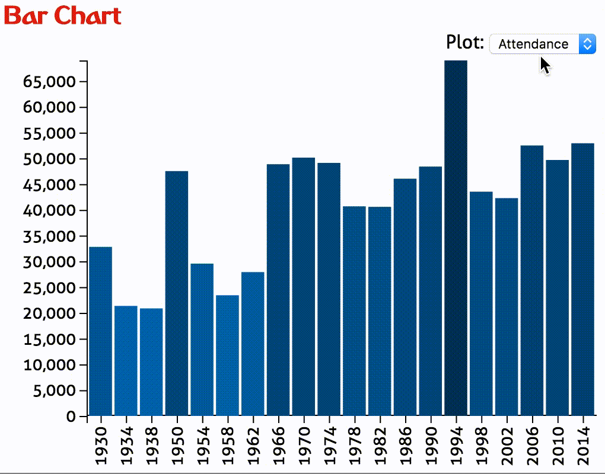

Visualization in HCI Homework 2
*Due: Wednesday, February 8, 12:00pm (noon).*

In this assignment you will create an interactive bar chart that display statistics from Fifa World Cup Games dating back to 1930. We've retrieved the data from [FIFA's website](http://www.fifa.com/fifa-tournaments/statistics-and-records/worldcup/).

## Visualization design

We are going to compare several attributes of every World Cup since 1930.

The interactive **bar chart** will allow us to see the evolution of attendance, total number of goals, the number of games, and the number of participating countries over the years.

Future homework assignments link these bar charts to other dimensions of interest, such as maps and detailed information panels.

## Implementation

We have provided boilerplate code that you should use to develop your solution.

Add your name and your e-mail address to the HTML elements at the top.

Other than adding your name, etc., you shouldn't need to edit hw2.html in this assignment (though you are free to optimize positioning, etc.)

Your project structure looks like this:

    hw2/
        hw2.html
        script.js # you'll be doing most of your work here
        styles.css
        data/
        	fifa-world-cup.csv
        assets/
        	# various assets
        figs/
        	# figures used in this description
        	# irrelevant for the project

Remember, to be able to access the data files with javascript, you will need to be *serving* the hw2 directory, not just opening the HTML file in a browser. If your development environment doesn't already launch a server for you, you can start one with:

    cd path/to/hw2
    # python 2
    python -m SimpleHTTPServer
    # python 3
    python -m http.server

And you can view the page at [http://localhost:8000](http://localhost:8000)

## About the data

We have taken care of the data loading for you in the homework skeleton. We're reading in the data from the `fifa-world-cup.csv` file.

The data (the global `allWorldCupData` variable) contains all the attributes you will need.
To better understand the structure of the data it's a good idea to look at the files and log the data objects to the console. Also take a closer look at the call to `d3.csv()` in the provided `script.js` file.

## Part I: Bar Chart

Your first task is to fill in the ``updateBarChart(selectedDimension)`` function. Create a bar chart that displays one of the numerical dimensions associated with each World Cup:

 * Average Attendance
 * Number of Goals
 * Number of Games
 * Number of Participants

Implement your bar chart such that it displays the dimension specified in the `selectedDimension` parameter.

Make sure to include x and y axes, with tick labels and use the proper d3 scales and axis.

Next, color each bar based on the selected data attribute (both height and color should encode the selected attribute); define and use the ``colorScale`` variable.

### Updating The Bar Chart

Make your bar-chart update the data it shows depending on the selection of the drop-down box, which calls `updateBarChart()` with the new `selectedDimension`.
When you're done with this part, your bar chart should behave like this:

## Part II: Selecting a Word Cup

In the `updateBarChart()` function, there is one location flagged with

    // ******* TODO: PART II*******

Here, you should make your bars respond to click events. This involves highlighting the selected bar with a different color, and outputting the selected bar to the javascript console using console.log().

## Grading

The rubrics on the assignment are:

75%: Part I: Bar chart shows current selection, with appropriate scales, axes, and coloring.  Switching between the different attributes works.  
25%: Part II: Bars can be selected and are highlighted, and selection outputs the selected bar to the javascript console.  
