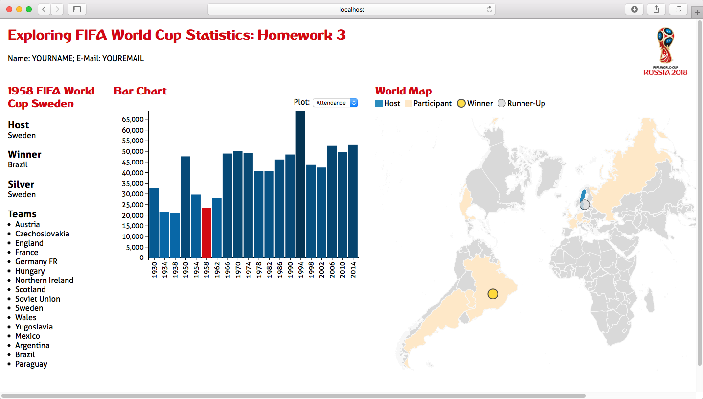
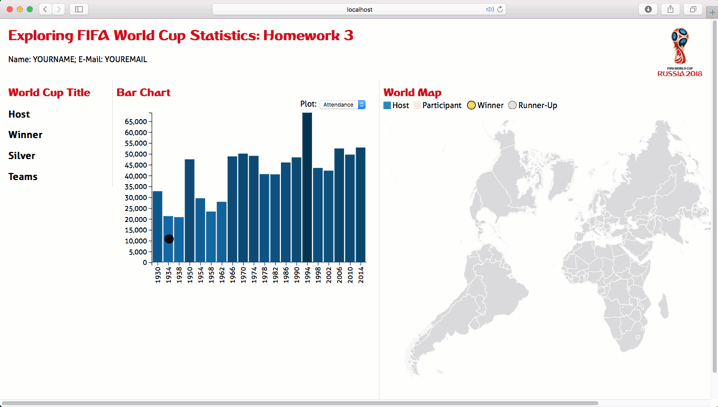

#Visualization in HCI Homework 3
*Due: Wednesday, February 15, 12:00pm (noon).*

In this assignment you add a map and an info panel to HW2, that are linked to each other and display statistics from Fifa World Cup Games dating back to 1930.

## Visualization design

We are going to make the bar chart visualization from HW2 to select a year and visualize the information for that selected year in a map and info panel.

The **bar chart** will be the same as HW2.

The **world map** will highlight the host country, all participating  countries, as well as the gold and silver medal winners.

The **info panel** will display host, winner and runner-up, and show a list of all participants.

The bar chart will act as our way to select a particular world cup: by clicking the bar associated with the year, the map and the info box will display the data associated with that world cup.

Your final visualization should look roughly like that:



## Implementation

We have provided boilerplate code that you should use to develop your solution.

As in previous homeworks, add your name and your e-mail address to the HTML elements at the top.

Other than adding your name, etc., you shouldn't need to edit hw3.html in this assignment (though you are free to optimize positioning, etc.)

Your project structure looks like this:

    hw3/
        hw3.html
        script.js # you'll be doing most of your work here
        styles.css
        data/
        	fifa-world-cup.csv
        	world.json
        assets/
        	# various assets
        figs/
        	# figures / videos used in the description
        	# irrelevant for the project


Remember, to be able to access the data files with javascript, you will need to be *serving* the hw3 directory, not just opening the HTML file in a browser. If your development environment doesn't already launch a server for you, you can start one with:

    cd path/to/hw3
    # python 2
    python -m SimpleHTTPServer
    # python 3
    python -m http.server

And you can view the page at [http://localhost:8080](http://localhost:8080)

## About the data

We have taken care of the data loading for you in the homework skeleton. We're reading in the data from the `fifa-world-cup.csv` file and the map from the `world.json` TopoJSON file.

The data (the global `allWorldCupData` variable) contains all the attributes you will need.
To better understand the structure of the data it's a good idea to look at the files and log the data objects to the console. Also take a closer look at the call to `d3.csv()` in the provided `script.js` file.

## Part I: Update Bar Chart Selection

You should have built an interactive bar chart as described in [HW2](../hw2/).  You will need to copy over the relevant code into the new `script.js` file.  In that prior homework, you only needed to make a selection in the bar chart output to the console.  However, in this homework, you will need to update the `updateBarChart()` to call call the map update and info panel update functions while passing the selected world cup event to them.

## Part II: Info Panel

Now that these updates are triggered, your next task is to update the text fields in the info panel on the left using the selected world cup. Show the following attributes of the selected year: World Cup Title ('EDITION' attribute of the data object), host, winner, runner_up, and a list of the participating teams.


## Part III: Create Map

Next is the map. Start by filling in ``drawMap()`` to draw the background. We have provided you with the projection, including the scaling and translation necessary to center it in the designated map area.

Because we will be handling different countries independently, it is important how we create and keep track of each path element!

Note that in the .css styles provided in styles.css, we have provided the following classes:

```css
.countries {
	stroke: #f7f7f7;
	fill: #d9d9d9;
	}
   .team {
   		fill: #fee8c8;
   }
   .host {
      fill: #2b8cbe;
	}
```

These classes are meant to facilitate the task of styling each country path element according to its role. As you may have guessed, all the country path elements should be assigned the countries class. We will use the other two classes when updating the map.

Another important task is going to be styling specific countries (such as the host country) when updating the map for a selected year. Since there is only one of each country, we can use ids to tag them. The id field provided in the .json data might come in handy here!

## Part IV: Update Map

Update the map for a selected world cup, as triggered from the bar chart.

Recall that the aspects we want to highlight are:

 * participating countries,
 * host country,
 * winning team,
 * runner up team.

We want to use color to encode the participating and host country, and a marker to mark the winning team and runner up. This avoids the tricky situation of having to color a country in two colors, which would happen if the host wins, which happened a few times in history.

As mentioned in the createMap() stage, we have created classes to style the hosting country (.host) and the participating countries (.team). Make sure and take advantage of those to style the appropriate path elements.

Here is the map as it should look like for the 1994 World Cup in the US:


When updating to another world cup, you fist have to clear the selections. Do this in the `clearMap()` function. This should remove highlights from countries and the markers representing winning teams.

## DONE!

Your final solution should behave something like:


## Extra Credit

Make all the countries respond to a click event by displaying a list of World Cups they participated in. Also display if they were ever winners or runner ups. Add this information to a new, separate panel.

Finally, I will also reward any creative yet tasteful enhancements to the visualization.  Please document any extra credit enhancements in a `readme.md` file in your hw3 directory.

## Grading

The rubrics on the assignment are:

10%: Part I: Bars can be selected and are highlighted, the update functions for map and info panel are called with a single world cup object.  
30%: Part II: Text is properly displayed and updated in the info panel.
30%: Part III: Map is properly rendered including proper class/id assignment to the path elements.  
30%: Part IV: Map updates correctly when user selects a year in the barChart. This includes correct styling of colors and position of markers on the map.  
10%: Extra Credit: Countries respond to click event properly by displaying the correct information in a new panel
Up to 20% Extra Credit:  Creative and tasteful enhancements to the visualization that go beyond the scope of the assignment
